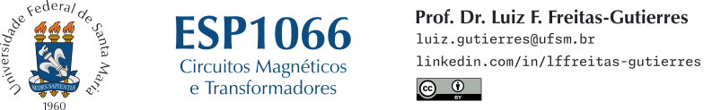

# ESP1066

**ESP1066** é a disciplina intitulada [Circuitos Magnéticos e Transformadores](https://www.ufsm.br/ementario/disciplinas/ESP1066), ofertada no Curso de Graduação em Engenharia Elétrica da [Universidade Federal de Santa Maria](https://www.ufsm.br/). Este repositório reúne listas de exercícios, roteiros para simulações computacionais, tarefas e materiais complementares.

**Docente:** [Prof. Dr. Luiz Fernando Freitas-Gutierres](https://www.linkedin.com/in/lffreitas-gutierres/) ([luiz.gutierres@ufsm.br](mailto:luiz.gutierres@ufsm.br)). 