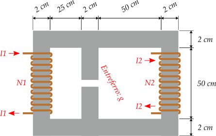

# ESP1066 (Circuitos Magnéticos e Transformadores)

**Docente:** [Prof. Dr. Luiz Fernando Freitas-Gutierres](https://www.linkedin.com/in/lffreitas-gutierres/) ([luiz.gutierres@ufsm.br](mailto:luiz.gutierres@ufsm.br)). 

## Roteiro da Simulação 01

**Leia com atenção as instruções abaixo.**

A Figura 1 ilustra um circuito magnético cujo núcleo ferromagnético possui uma área da seção transversal quadrada. Existem dois enrolamentos de cobre constituídos por $N_1$ e $N_2$ espiras, assim como um entreferro com comprimento médio igual a $g$ cm. No [*Finite Element Method Magnetics* (FEMM), versão 4.2](https://www.femm.info/wiki/HomePage), execute simulações para o cenário de investigação proposto e faça o que se pede:

1. O material do núcleo ferromagnético é **linear**. No FEMM, utilize $\mu_x = \mu_y = \mu_r$.
2. Gerar uma vista com a representação das linhas de fluxo magnético e da distribuição da indução magnética ao longo do núcleo. Discutir como o espraiamento e fluxos magnéticos dispersos afetam a indução magnética em diferentes partes do núcleo.
3. Produzir um gráfico do módulo da densidade do fluxo magnético $|B_g|$ através de uma linha no entreferro. Discorrer sobre a diferença do valor médio da indução magnética no entreferro e na coluna central do núcleo.
4. Considerar as seguintes alterações nas correntes elétricas $I_1 = I_2 = 2:6:10:14:18:22:26:30$ A e levantar a curva $|B_g| \times I_1 = I_2$.
5. Verificar as densidades médias de fluxo magnético nas colunas laterais e central.
6. Verificar a densidade de fluxo magnético na coluna central quando o sentido de $I_2$ é invertido. Gerar uma vista com a distribuição da indução magnética ao longo do núcleo. Discutir sobre os efeitos dessa mudança.
7. Determinar a indutância equivalente de cada enrolamento.
8. Resolver analiticamente este cenário de estudo e constatar diferenças.

**Observações:**

- Para os enrolamentos do circuito magnético, utilize o material *Copper AWG Magnet Wire* no FEMM. A medida dos fios é irrelevante para esta simulação.
- Respeitar as modificações de parâmetros estipuladas para cada discente na tabela abaixo.
- Utilizar, obrigatoriamente, o modelo de relatório proposto para esta atividade.
- Enviar o arquivo do relatório no formato PDF e, compactados para ZIP, os arquivos de simulação e/ou *scripts* desenvolvidos. Empregue este formato para nomear os arquivos:
    - Para o relatório: `PrimeiroNomeÚltimoSobrenome-Sim01-Rel.pdf`. Exemplo: Fulano de Beltrano Sicrano $\rightarrow$ `FulanoSicrano-Sim01-Rel.pdf`.
    - Para o arquivo ZIP: `PrimeiroNomeÚltimoSobrenome-Sim01-Arq.zip`. Exemplo: Fulano de Beltrano Sicrano $\rightarrow$ `FulanoSicrano-Sim01-Arq.zip`.

| Discente   | $N_1$ | $N_2$ | $I_1$ | $I_2$ | $g$   | $\mu_r$ |
|:----------:|:-----:|:-----:|:-----:|:-----:|:-----:|:-------:|
| 2023520344 | 597   | 933   | 10    | 1     | 0,10  | 1000    |
| 202020894  | 595   | 1125  | 20    | 1     | 0,15  | 1100    |
| 201812457  | 318   | 1613  | 10    | 2     | 0,20  | 1200    |
| 202112196  | 515   | 1398  | 20    | 2     | 0,25  | 1300    |
| 202011297  | 373   | 724   | 10    | 3     | 0,30  | 1400    |
| 201920754  | 420   | 1070  | 20    | 3     | 0,35  | 1500    |
| 202220723  | 385   | 1160  | 10    | 4     | 0,40  | 1600    |
| 201720832  | 391   | 1831  | 20    | 4     | 0,45  | 1700    |
| 202120303  | 360   | 1645  | 10    | 1     | 0,50  | 1800    |
| 2022520213 | 399   | 772   | 20    | 1     | 0,55  | 1900    |
| 202210608  | 500   | 1916  | 10    | 2     | 0,60  | 2000    |
| 201512571  | 525   | 1664  | 20    | 2     | 0,65  | 1000    |
| 202012512  | 322   | 1353  | 10    | 3     | 0,70  | 1100    |
| 2022520169 | 344   | 783   | 20    | 3     | 0,75  | 1200    |
| 201720842  | 449   | 1861  | 10    | 4     | 0,80  | 1300    |
| 202020163  | 365   | 1437  | 20    | 4     | 0,85  | 1400    |
| 202211672  | 396   | 1178  | 10    | 1     | 0,90  | 1500    |
| 202220071  | 461   | 772   | 20    | 1     | 0,95  | 1600    |
| 202220536  | 509   | 840   | 10    | 2     | 1,00  | 1700    |
| 201620497  | 511   | 1220  | 20    | 2     | 1,05  | 1800    |
| 202120774  | 479   | 1435  | 10    | 3     | 1,10  | 1900    |
| 201710071  | 435   | 1669  | 20    | 3     | 1,15  | 2000    |
| 2022520203 | 394   | 1294  | 10    | 4     | 1,20  | 1000    |
| 202120335  | 527   | 1656  | 20    | 4     | 1,25  | 1100    |
| 201820222  | 496   | 754   | 10    | 1     | 1,30  | 1200    |
| 202120489  | 408   | 1324  | 20    | 1     | 1,35  | 1300    |
| 201920802  | 457   | 1269  | 10    | 2     | 1,40  | 1400    |
| 202121237  | 436   | 858   | 20    | 2     | 1,45  | 1500    |
| 201720840  | 472   | 1973  | 10    | 3     | 1,50  | 1600    |
| 2023520546 | 427   | 1972  | 20    | 3     | 1,55  | 1700    |
| 202111411  | 521   | 1240  | 10    | 4     | 1,60  | 1800    |