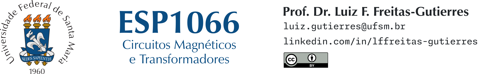

# ESP1066 (Circuitos Magnéticos e Transformadores)

**Docente:** [Prof. Dr. Luiz Fernando Freitas-Gutierres](https://www.linkedin.com/in/lffreitas-gutierres/) ([luiz.gutierres@ufsm.br](mailto:luiz.gutierres@ufsm.br)).

## Tarefa 03

**Leia com atenção as instruções abaixo.**

Sobre o ciclo de histerese em materiais ferromagnéticos e as perdas no ferro:

1. Conceitue o ciclo de histerese e explicar seus principais pontos operacionais.
2. Descreva as perdas no ferro em dispositivos eletromagnéticos.
3. Explique a estimativa das perdas no ferro por meio das equações de Steinmetz.

**Observações:**

- Utilize, obrigatoriamente, o campo de resposta disponível no Moodle, no qual é possível inserir também figuras e equações.
