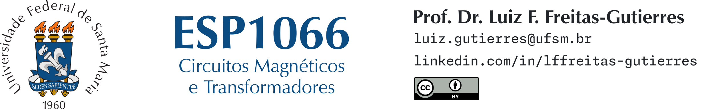

# ESP1066 (Circuitos Magnéticos e Transformadores)

**Docente:** [Prof. Dr. Luiz Fernando Freitas-Gutierres](https://www.linkedin.com/in/lffreitas-gutierres/) ([luiz.gutierres@ufsm.br](mailto:luiz.gutierres@ufsm.br)).

## Tarefa 05

**Leia com atenção as instruções abaixo.**

Sobre transformadores trifásicos, responda às seguintes questões:

1. Descreva as principais características construtivas dos transformadores trifásicos.
2. Explique o princípio de funcionamento dos transformadores trifásicos.
3. Analise as características fasoriais de um transformador trifásico com conexão **Dy11**.
4. Analise as características fasoriais de um transformador trifásico com conexão **Dy1**.
5. Analise as características fasoriais de um transformador trifásico com conexão **Yy0**.

**Observações:**

- As respostas devem ser inseridas, exclusivamente, no campo específico disponibilizado na plataforma Moodle, o qual também permite a inserção de figuras e equações.
- Esta é uma atividade avaliativa individual.